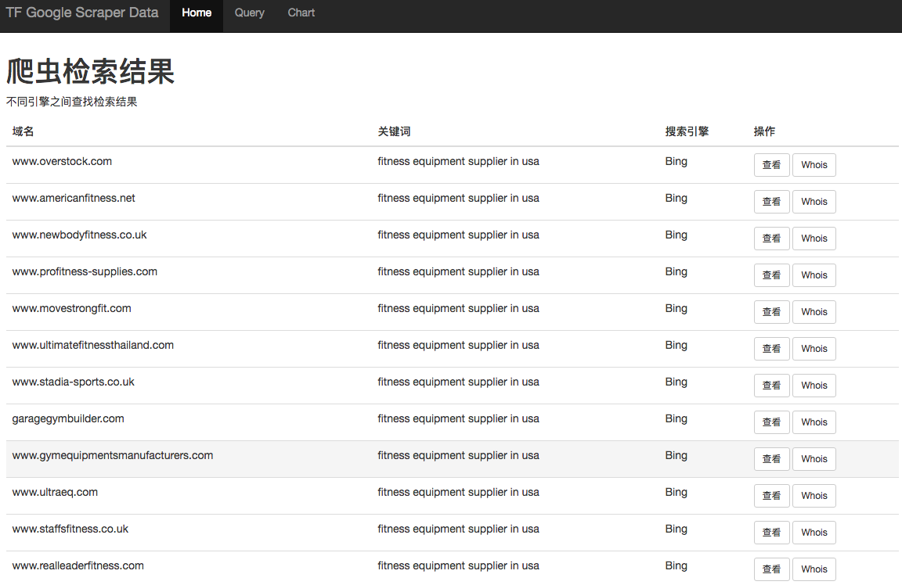

## Google Scraper Data

This project for reading GoogleScraper output json then insert the data into MySQL or other database.
Query the data and show the data by website client. Easy for querying and searching.

Check the link [GoogleScraper](https://github.com/NikolaiT/GoogleScraper), learn more about **GoogleScraper**. GoogleScraper provide command line to fetch data from different search engines.

```bash
GoogleScraper .... --output-filename output.json ...
```

this command will store the data as JSON format type.
```json
[{
  "effective_query": "",
  "id": "2",
  "no_results": "True",
  "num_results": "10",
  "num_results_for_query": "21-30 of 7,050,000 results",
  "page_number": "3",
  "query": "your keywords",
  "requested_at": "2018-05-10 09:05:49.749648",
  "requested_by": "localhost",
  "results": [....]
}, {.....}]
```

Read data from JSON file, write data into MySQL.

Here are tables' structure.
```sql
CREATE TABLE keywords(
  id INT PRIMARY KEY AUTO_INCREMENT,
  value VARCHAR(255),
  requested_at DATETIME,
  requested_by VARCHAR(255),
  num_results INT,
  search_engine INT
);

CREATE TABLE results (
  id INT PRIMARY KEY AUTO_INCREMENT,
  domain VARCHAR(255),
  link VARCHAR(1000),
  rank INT,
  snippet TEXT,
  title TEXT,
  visible_link VARCHAR(1000),
  keywords INT
);

CREATE TABLE search_engine (
  id INT PRIMARY KEY AUTO_INCREMENT,
  name VARCHAR(255),
  site VARCHAR(255)
);
```


